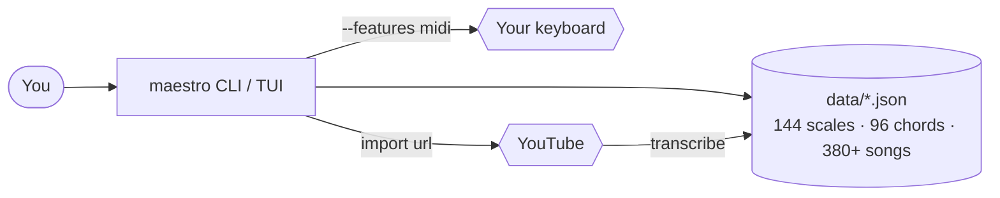

# Maestro

A terminal piano-learning companion written in Rust. Browse and play scales,
chord progressions and songs on a real MIDI keyboard (e.g. a CASIO), watch an
on-screen piano light up the keys, **import any song from a YouTube URL**, build
playlists, and **learn pieces interactively** — Maestro shows the next note,
waits until you play it, and scores you.



See **[docs/architecture.md](docs/architecture.md)** for the full design with
diagrams.

## Quick start

```sh
cargo run                              # full-screen interactive menu
cargo run -- songs                     # list songs
cargo run -- play el_manicero          # play to the default device
cargo run -- scale c_major --play
cargo run -- chord c_i_iv_v

# with a real keyboard (Windows works out of the box; Linux needs ALSA — see below)
cargo run --features midi -- devices
cargo run --features midi -- play amor_cortes --device 3 --bpm 90 --metronome
cargo run --features midi -- learn twinkle           # interactive wait-mode
cargo run --features midi -- metronome --bpm 100     # standalone click track
```

In the **interactive menu** (`cargo run`): arrow keys to move, type to search,
`Enter` to play, `+`/`-` to change the BPM, `m` to toggle the metronome click,
`s` to switch the visual (scrolling staff / piano keyboard / both), `Esc` to
stop. Pick your output device under **MIDI Devices** (it's remembered).

## Import any song from YouTube

```sh
maestro setup                                  # one-time; works on any Python
maestro import "https://youtube.com/watch?v=…" --save my_song
maestro play my_song --device 3
maestro learn my_song
```

`setup` builds a small Python venv and installs the transcription tools (a
numpy-only backend that works even on Python 3.14; `--melody`/`--full` add
higher-quality backends that need Python 3.10–3.12). The pipeline downloads the
audio, transcribes it, auto-detects the key, and quantizes the result. It's
approximate, but it captures the real notes so you can learn the tune. See
**[docs/playlists.md](docs/playlists.md)**.

## Features

- **Interactive menu** — arrow-key navigation, type-to-search, scrolling lists.
- **Live ASCII piano** — the played key(s) light up (all of them for both-hands
  arrangements) and the keyboard scrolls to follow the music.
- **Sight-reading staff** — a scrolling treble+bass grand staff shows the notes
  as sheet music flowing past a playhead, so you learn to *read* while you play
  (`s` toggles staff / keyboard / both).
- **Wait-mode learning** — `learn <song>` advances only when you play the right
  note, with ear feedback and an accuracy score; `--octave-any` to be forgiving.
- **Import** — from a **YouTube URL**, a `.mid` file, or a typed text tab.
- **Playlists** — build ordered sets, play back-to-back, and export a
  self-contained bundle to share.
- **Tempo in BPM & metronome** — set the pace by `--bpm` (or `+`/`-` live in the
  TUI), toggle an accented woodblock click with `--metronome` / `m`, or run a
  standalone `metronome` click track.
- **Device picker** — choose and remember your output keyboard.
- **Catalogue** — 144 scales (12 keys × 12 types), 96 chord progressions, and
  380+ songs/etudes, all JSON under `data/`.
- **Users & progress** — local `register`/`login` with per-user practice stats.

## Command reference

| Command | Description |
|---------|-------------|
| `maestro` / `tui` | Interactive full-screen menu (default) |
| `scales` / `scale <id> [--play]` | List / show a scale |
| `chords` / `chord <id>` | List / show a chord progression |
| `songs` / `play <id> [--device N] [--bpm N] [--metronome] [--beats N]` | List / play a song (in BPM, optional click) |
| `metronome [--bpm N] [--beats N] [--bars N]` | Standalone metronome click track |
| `learn <id\|file> [--input N] [--octave-any]` | Interactive wait-mode practice |
| `import <url\|file> [--save id] [--play]` | Import from YouTube, `.mid`, or a tab |
| `setup [--melody\|--full] [--python P]` | Install the YouTube-import toolchain |
| `playlists` · `playlist create/add/remove/show/play/export/import` | Playlists |
| `devices` | List MIDI input/output devices |
| `register/login/logout/whoami/progress` | Local users + practice tracking |
| `config [show\|set-device\|set-tempo\|set-metronome]` | Inspect or edit configuration |

Run `maestro <command> --help` for details.

## Building

The default build needs **no** system libraries:

```sh
cargo build
cargo test
```

Live MIDI on Linux needs ALSA dev headers; Windows/macOS do not:

```sh
sudo apt-get install -y libasound2-dev    # Linux only
cargo run --features midi -- devices
```

On Windows you can also drive a CASIO with **no Rust build** via the WinMM
scripts in [`scripts/windows/`](scripts/windows/).

## Documentation

- [docs/architecture.md](docs/architecture.md) — design & diagrams
- [docs/learning.md](docs/learning.md) — wait-mode learning & the text-tab format
- [docs/playlists.md](docs/playlists.md) — playlists, importing, YouTube setup
- [docs/cli.md](docs/cli.md) — CLI reference
- per-scale / per-chord lesson pages under [docs/](docs/)

## License

MIT — see [`LICENSE`](LICENSE).
