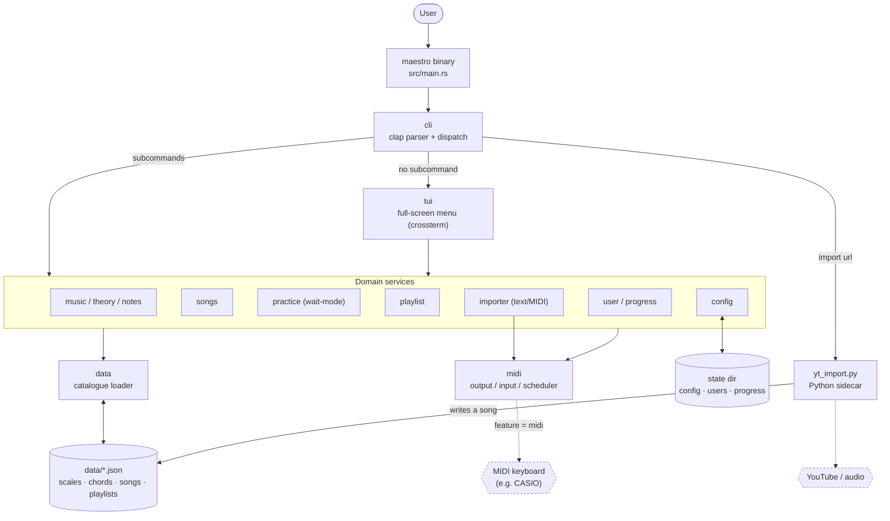
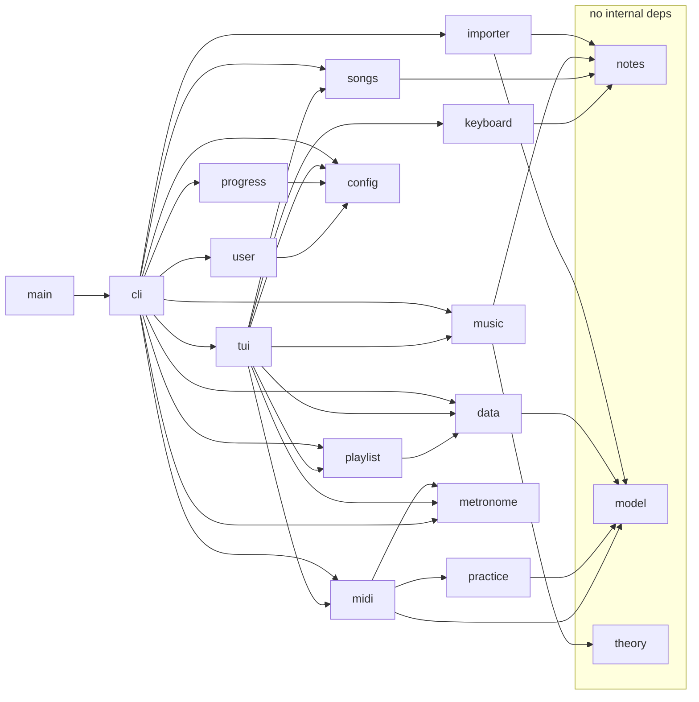
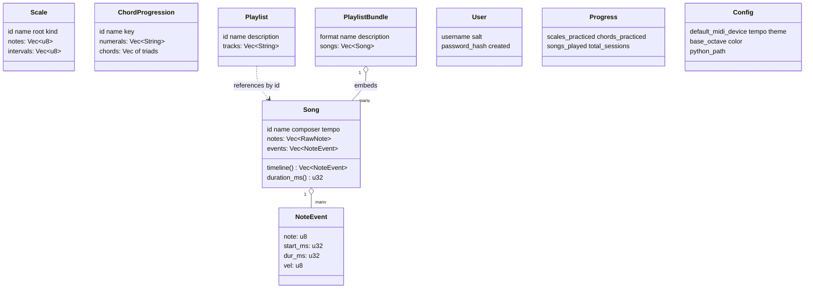
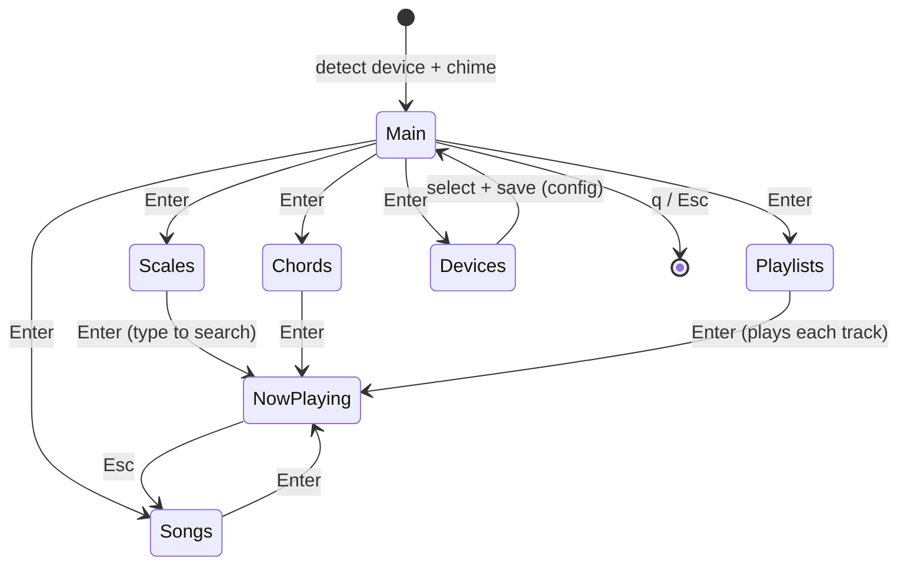
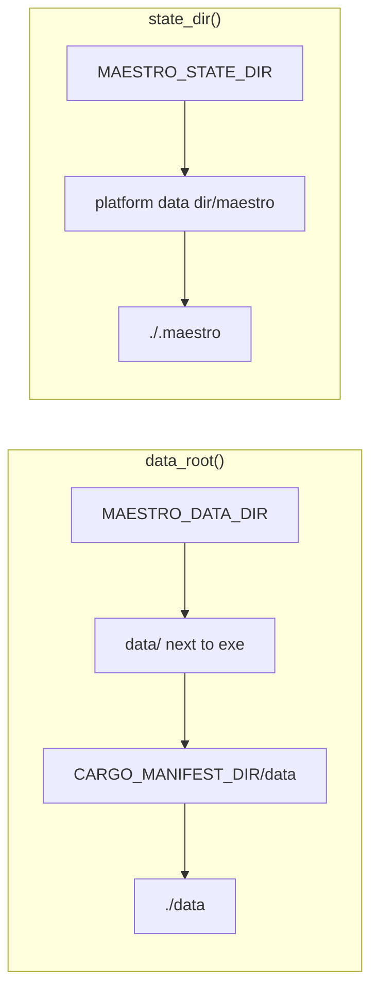
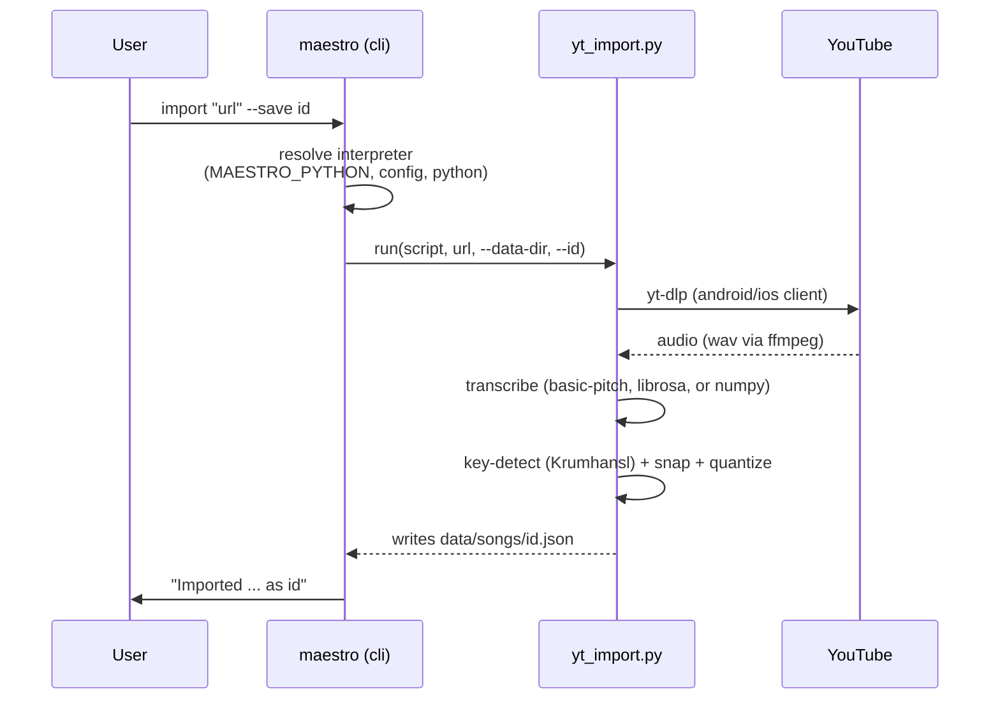
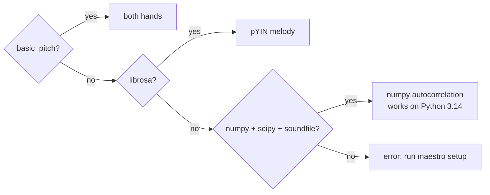
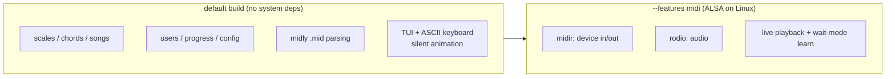

# Architecture

Maestro is a Rust **library crate** (`src/lib.rs`) plus a thin **binary**
(`src/main.rs`). All logic lives in the library so it is unit- and
integration-testable without a terminal or MIDI hardware. Live MIDI I/O is
behind the optional `midi` cargo feature; the music catalogue lives as JSON
under `data/`; and an optional Python sidecar transcribes audio for the
"import from YouTube" feature.



## Layers

| Layer | Modules | Responsibility |
|-------|---------|----------------|
| Entry | `main`, `cli` | Parse args (clap), dispatch to a command or the TUI |
| UI | `tui`, `keyboard` | Full-screen crossterm menu; ASCII piano rendering |
| Domain | `music`, `theory`, `notes`, `songs`, `practice`, `playlist`, `importer`, `metronome`, `user`, `progress`, `config` | The music/learning logic |
| Data | `model`, `data` | Serde types and the JSON-catalogue loader |
| I/O | `midi` | Device output/input + the playback scheduler (feature-gated) |
| Sidecar | `scripts/yt_import.py` | Download + transcribe audio → a song JSON |

## Module dependency graph

Arrows mean "uses". Leaf modules (`notes`, `theory`, `model`) have no internal
dependencies, which keeps them trivially testable.



## Data model

The catalogue and on-disk state are plain serde structs. A `Song` can be a
simple monophonic `notes` list **or** a polyphonic `events` list (both hands);
`Song::timeline()` yields one unified, time-stamped event stream either way.



## Playback: the timeline scheduler

Every playable thing — a scale, a chord progression, a monophonic or polyphonic
song — is reduced to a `Vec<NoteEvent>`. The TUI scheduler advances a song-time
clock, turning notes on/off at their event times, lighting the on-screen
keyboard with **all** currently-held notes, and honouring live `+`/`-` BPM
changes, the `m` metronome toggle, and `Esc`.

Tempo is expressed in **BPM**: playback speed is `target_bpm / native_bpm` (the
`metronome` module owns this arithmetic). The metronome click rides the piece's
own beat grid in song-time, so it always sounds at the chosen BPM regardless of
the speed scaling; the click is a woodblock on the General MIDI percussion
channel, accented on each downbeat.

```mermaid
flowchart TB
    entry["Entry / Song"] --> tl["entry_timeline()<br/>Vec of NoteEvent"]
    tl --> loop{"t <= total?"}
    loop -- yes --> on["note_on for events with start <= t"]
    on --> off["note_off for events that ended"]
    off --> click["metronome click on the beat grid (channel 9)"]
    click --> draw["now_playing(): progress bar + BPM +<br/>live keyboard of held notes"]
    draw --> poll["poll_step(step / speed),  speed = bpm / native"]
    poll -->|Esc / Ctrl-C| stop["all_off, return interrupted"]
    poll -->|plus / minus| bpm["adjust BPM"] --> adv
    poll -->|m| mt["toggle metronome"] --> adv
    poll -->|timeout| adv["t += STEP"]
    bpm --> loop
    adv --> loop
    loop -- no --> done["all_off"]
```

`midi::MidiSink` is the only thing that actually sends bytes; without the `midi`
feature it is a no-op, so the UI still animates silently (and tests run with no
audio stack). The CLI uses a headless variant, `midi::play_timeline`.

## Interactive TUI flow



## Catalogue & state resolution

`data::data_root()` and `config::state_dir()` search a small list of locations
so Maestro works from the repo, from an installed binary, or under tests.



- **Catalogue** (`data/`): `scales/` `chords/` `songs/` `playlists/`, one JSON
  per item — adding content is a data change, not code.
- **State** (`state_dir`): `config.json`, `users.json`, `progress/<user>.json`,
  and the import `yt-venv/`.

## YouTube import pipeline

`maestro import <url>` shells out to a Python sidecar so the heavy audio/ML deps
stay out of the Rust binary. `maestro setup` creates a venv and remembers its
interpreter in `config.python_path`.



Transcription backend is chosen by availability, best first:



## The `midi` feature



Default builds and all tests need **no** system libraries. `--features midi`
adds `midir`/`rodio` for live device I/O (Windows WinMM works out of the box;
Linux needs `libasound2-dev`). The Windows scripts under `scripts/windows/`
drive a keyboard over WinMM with no Rust build at all.

## Testing strategy

- **Unit tests** live in each module (`notes`, `theory`, `practice`, `importer`,
  `user`, `progress`, `config`, `keyboard`, `playlist`, `music`).
- **Integration tests** (`tests/catalogue.rs`) load and validate the whole JSON
  catalogue.
- The TUI is exercised by driving the binary through a pseudo-terminal.
- Because `MidiSink` is a no-op without the feature, everything is testable with
  no audio hardware.
